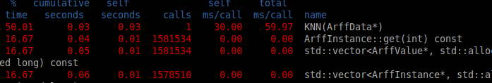
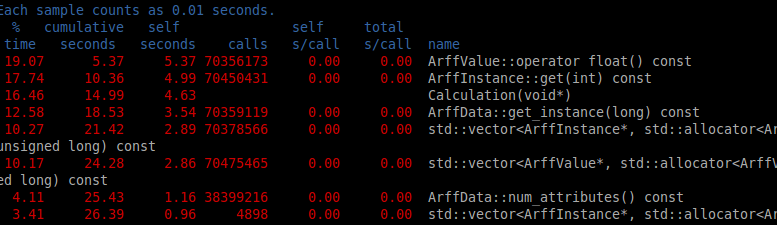
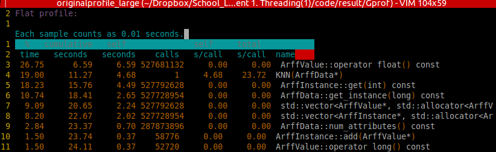
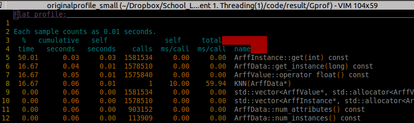

## CMSC 691 High Performance Distributed System
## Assignment 1
### Liang Xu

### Motivation and Questions
Big data mining involves the use of datasets with millions of instances. The computational complexity of
machine learning methods limits their scalability to larger datasets. The simplest classifier is the nearest-
neighbor classifier (1NN) but its computational complexity is O(n^2), where n is the number of instances.
You are provided the code for a sequential 1NN algorithm, which computes for each data instance the
distances to the other instances, and predicts the data class using the instance located within the smallest
Euclidean distance. Then, the accuracy of the classifier is measured as the relation between the number
of successful predictions and the number of instances. You may run the code using the datasets provided
and analyze how the runtime increases with regards of the size of the dataset.
Your job is to parallelize the code using threads and conduct all the code optimizations you consider
relevant to speed up its execution, as long as the output is correct. Should you consider critical sections
in your code, be aware of data races and employ the tools to guarantee the mutual exclusion. The faster
solution the better grade you get!

1. Compare the runtime of the serial and parallel versions considering the datasets with different sizes. Calculate the speedup using 2, 4, and 8 threads.
2. Estimate the proportion of parallel code by relating the speedup you get and the number of threads employed. What’s the maximum speedup you would be able to obtain using an infinite number of threads and cores?
3. Let’s run using 256 threads. What’s the speedup now?

### Coding
```c++
#include <stdio.h>
#include <stdlib.h>
#include <stdint.h>
#include <float.h>
#include <math.h>
#include <iostream>
#include "libarff/arff_parser.h"
#include "libarff/arff_data.h"

#include <pthread.h>
#include <semaphore.h>
#include <time.h>
#include <mutex>
#include <thread>

//#include <stdatomic.h>
//#include "c11threads.h"

using namespace std;
sem_t sem_main, sem_threads;
//int* predictions;

void *Calculation(void * arg);
void *Calculation2(void * arg);
struct Data{
  int* i;
  ArffData* dataset;
  int* predictions;
  int* n_threads;
} ;

int n_threads = 256;
int* confusionMatrix;
pthread_mutex_t mute_lock;


int* KNN(ArffData* dataset)
{
    int* predictions = (int*)malloc(dataset->num_instances() * sizeof(int));
    //printf("Number of Data points in the data set is %d",dataset->num_instances());

    for(int i = 0; i < dataset->num_instances(); i++) // for each instance in the dataset
    {
		printf("Number of interation %d \n",i);
        float smallestDistance = FLT_MAX;
        int smallestDistanceClass;

        for(int j = 0; j < dataset->num_instances(); j++) // target each other instance
        {
            if(i == j) continue;

            float distance = 0;

            for(int k = 0; k < dataset->num_attributes() - 1; k++) // compute the distance between the two instances
            {
                float diff = dataset->get_instance(i)->get(k)->operator float() - dataset->get_instance(j)->get(k)->operator float();
                distance += diff * diff;
            }

            distance = sqrt(distance);

            if(distance < smallestDistance) // select the closest one
            {
                smallestDistance = distance;
                smallestDistanceClass = dataset->get_instance(j)->get(dataset->num_attributes() - 1)->operator int32();
            }
        }

        predictions[i] = smallestDistanceClass;
    }

    return predictions;
}

void print_prediacton(int* predictions , ArffData* dataset)
{
  for(int i = 0; i < dataset->num_instances();i++){
    printf("i is %d Predictior is %d\n",i,predictions[i] );
  }
}

int* KNN_PARALLEL(ArffData* dataset)
{

    //printf("Number of Data points in the data set is %d",dataset->num_instances());


    int thread_ID[n_threads];
    //Initial thread ID
    int* predictions = (int*)malloc(dataset->num_instances() * sizeof(int));
    //printf("Total number is instances is %lu\n",dataset->num_instances() );

    for (int i = 0; i < n_threads; i++) {
        thread_ID[i]=i;
    }
    pthread_t *threads;
    threads = (pthread_t*)malloc(n_threads * sizeof(pthread_t));


    for(int i = 0; i < n_threads; i ++)
    {
      Data* data_pointer = (Data*)malloc(sizeof(Data));
      data_pointer->dataset = dataset;
      data_pointer->i = &thread_ID[i];
      data_pointer->predictions = predictions;
      data_pointer->n_threads = &n_threads;
      //printf("feed in struct i address  is %d, value is %d\n",&thread_ID[i],*data_pointer->i );
      pthread_create(&threads[i],NULL,Calculation,(void*)data_pointer);
    }

    for(int i = 0; i < n_threads; i++)
    {
        pthread_join(threads[i],NULL);
    }
    //print_prediacton(predictions,dataset);
    return predictions;
}

void *Calculation(void * arg)
{
        Data* data = (Data *) arg;

        ArffData* dataset = data->dataset;
        int i = *data->i;
        //cout<<"Thread number input is "<<i<<endl;
        int count = 0;
        //printf("Parallel Number of interation %d \n",*i);
        for(i ; i < data->dataset->num_instances(); i=i+*data->n_threads)
        {
          int smallestDistanceClass;
          float smallestDistance = FLT_MAX;
          //printf("data instance in thread %d is %d\n",*data->i,i );
          count = count + 1;
            for(int j = 0; j < dataset->num_instances(); j++) // target each other instance
            {
              if(i == j) continue;

              float distance = 0;

              for(int k = 0; k < dataset->num_attributes() - 1; k++) // compute the distance between the two instances
                {
                  float diff = dataset->get_instance(i)->get(k)->operator float() - dataset->get_instance(j)->get(k)->operator float();
                  distance += diff * diff;
                }

                distance = sqrt(distance);
                //cout <<"i is "<< i << "j is "<< j << "The distance is " << distance<<"smallestDistance is "<<smallestDistance << endl;

                //cout <<"i is "<< i << "j is "<< j << "The distance is " << distance << endl;

                if(distance < smallestDistance) // select the closest one
                {
                  //puts("Liang Xu");
                  smallestDistance = distance;
                  smallestDistanceClass = dataset->get_instance(j)->get(dataset->num_attributes() - 1)->operator int32();
                }
            }
        data->predictions[i] = smallestDistanceClass;
        //printf("i is %d Predication is %d\n",i,smallestDistanceClass );
      }
        printf("Finish Thread %d and %d instance have been done \n", *data->i,count);
    pthread_exit(0);
}
int* computeConfusionMatrix(int* predictions, ArffData* dataset)
{
    confusionMatrix = (int*)calloc(dataset->num_classes() * dataset->num_classes(), sizeof(int)); // matriz size numberClasses x numberClasses

    for(int i = 0; i < dataset->num_instances(); i++) // for each instance compare the true class and predicted class
    {
        int trueClass = dataset->get_instance(i)->get(dataset->num_attributes() - 1)->operator int32();
        int predictedClass = predictions[i];

        confusionMatrix[trueClass*dataset->num_classes() + predictedClass]++;
    }

    return confusionMatrix;
}
int* computeConfusionMatrix_parallel(int* predictions, ArffData* dataset)
{
    //int confusionMatrix[dataset->num_classes() * dataset->num_classes()]; // matriz size numberClasses x numberClasses
    confusionMatrix = (int*)calloc(dataset->num_classes() * dataset->num_classes(), sizeof(int)); // matriz size numberClasses x numberClasses
    int thread_ID[n_threads];
    for (int i = 0; i < n_threads; i++) {
        thread_ID[i]=i;
    }
    pthread_t *threads;
    threads = (pthread_t*)malloc(n_threads * sizeof(pthread_t));
    for(int i = 0; i < n_threads; i ++)
    {
      Data* data_pointer = (Data*)malloc(sizeof(Data));
      data_pointer->dataset = dataset;
      data_pointer->i = &thread_ID[i];
      data_pointer->predictions = predictions;
      data_pointer->n_threads = &n_threads;
      pthread_create(&threads[i],NULL,Calculation2,(void*)data_pointer);
    }

    for(int i = 0; i < n_threads; i++)
    {
        pthread_join(threads[i],NULL);
    }
    return confusionMatrix;
}

void *Calculation2(void * arg)
{
        Data* data = (Data *) arg;

        ArffData* dataset = data->dataset;
        int i = *data->i;
        //int * confusionMatrix = data->predictions;
        int count = 0;
        for(i ; i < data->dataset->num_instances(); i=i+*data->n_threads)
        {
        int trueClass = dataset->get_instance(i)->get(dataset->num_attributes() - 1)->operator int32();
        int predictedClass = data->predictions[i];
        pthread_mutex_lock(&mute_lock);
        confusionMatrix[trueClass*dataset->num_classes() + predictedClass]++;
        pthread_mutex_unlock(&mute_lock);
        }
        printf("ConfusionMatrix Finish Thread %d and %d instance have been done \n", *data->i,count);
    pthread_exit(0);
}

float computeAccuracy(int* confusionMatrix, ArffData* dataset)
{
    int successfulPredictions = 0;

    for(int i = 0; i < dataset->num_classes(); i++)
    {
        successfulPredictions += confusionMatrix[i*dataset->num_classes() + i]; // elements in the diagnoal are correct predictions
    }

    return successfulPredictions / (float) dataset->num_instances();
}

int main(int argc, char *argv[])
{
    if(argc != 2)
    {
        cout << "Usage: ./main datasets/datasetFile.arff" << endl;
        exit(0);
    }

    ArffParser parser(argv[1]);
    ArffData *dataset = parser.parse();
    //data.dataset = dataset;
    struct timespec start, end;

    //predictions = (int*)malloc(dataset->num_instances() * sizeof(int));

    clock_gettime(CLOCK_MONOTONIC_RAW, &start);
    // First step try to paralle this part.
    int* predictions = KNN_PARALLEL(dataset);

    int* confusionMatrix = computeConfusionMatrix(predictions,dataset);

    float accuracy = computeAccuracy(confusionMatrix, dataset);

    clock_gettime(CLOCK_MONOTONIC_RAW, &end);
    uint64_t diff = (1000000000L * (end.tv_sec - start.tv_sec) + end.tv_nsec - start.tv_nsec) / 1e6;

    printf("The 1NN classifier for %lu instances required %llu ms CPU time, accuracy was %.4f\n", dataset->num_instances(), (long long unsigned int) diff, accuracy);
}

```

Two parallel sections are using in the codding. One section is To parallel the KNN function. Second function is for computeConfusionMatrix function. One pthread lock used in the computeConfusionMatrix fucntion to protect the confusionMatrix variable. According to the profiler analysis.     
    
KNN function take almost 50%  time in the entire calculation.
After we parallel the program. KNN fucntion is called Calculation this time.




## Questions
#### 1. Compare the runtime of the serial and parallel versions considering the datasets with different sizes. Calculate the speedup using 2, 4, and 8 threads.

First, let's start to analysis with the original program.
```
1. The 1NN classifier for 336 instances and 8 instance required 59 ms CPU time, accuracy was 0.7917
2. The 1NN classifier for 4898 instances and 12 instance required 18628 ms CPU time, accuracy was 0.6162

```

| DataSet | Thread | Parallel Performance | Serial Performance | SpeedUp |
|---------|--------|----------------------|--------------------|---------|
| Small   |    1   |           0          |        59 ms       |    X    |
| Small   |    2   |         33 ms        |        59 ms       |  1.788  |
| Small   |    4   |         20 ms        |        59 ms       |   2.95  |
| Small   |    8   |         17 ms        |        59 ms       |  3.471  |
| Medium  |    1   |           0          |        18628       |    X    |
| Medium  |    2   |        9275 ms       |      18628 ms      |  2.008  |
| Medium  |    4   |        4667 ms       |      18628 ms      |  3.9914 |
| Medium  |    8   |        3453 ms       |      18628 ms      |  5.3947 |
The max speed up I got is 5.3947.
I got different speed up between the small dataset and media dataset. I think the reason is in the medium dataset, the calculation part(KNN) take more percentage of the total running time. Let check the assumption with the profiler results.
##### Small Data set

##### Medium Data set


In the Small data set the percentage of KNN is only 16.67% however in the medium data set the percentage goes up to 19.00%. This phonominal indicates the parallel part of the program.

#### 2. Estimate the proportion of parallel code by relating the speedup you get and the number of threads employed. What’s the maximum speedup you would be able to obtain using an infinite number of threads and cores?

##### for small dataset.
According to Amanda's law.
let x = percentage of parallel part of the program
1/[(1-x)+x/thread_number] = speedup.
Science my computer is 6 cores, so 8 thread may only using 6 cores to acceletate the code. So I am going to use the 2 and 4 thread results.
```
x_2thread = 0.8814    
x_4thread = 0.8813
```
So if we use infinite thread, the speed up will be
```
Answer =1/(1-0.8814) = 8.431

```

##### for medium dataset.

```
x_2thread = 1
x_4thread = 1
x_8thread = 0.98
```
So if we use infinite thread, the speed up will be
```
Answer =1/(1-0.98) = 50
This is an approximated vale. In this problem I found the parallel part takes most of the program.

```
#### 3. Let’s run using 256 threads. What’s the speedup now?
```
The 1NN classifier for 336 instances required 31 ms CPU time, accuracy was 0.7917
The 1NN classifier for 4898 instances required 3277 ms CPU time, accuracy was 0.6162
```
| DataSet | Thread | Parallel Performance | Serial Performance | SpeedUp |
|---------|--------|----------------------|--------------------|---------|
|  Small  |    4   |         20 ms        |        59 ms       |   2.95  |
|  Small  |    8   |         17 ms        |        59 ms       |  3.471  |
|  small  |   256  |         31 ms        |        59 ms       |  1.903  |
|  Medium |    8   |        3453 ms       |      18628 ms      |  5.3947 |
|  Medium |   256  |        3277 ms       |      18628 ms      |  5.6844 |

For medium dataset, the speedup using 256 threads are similar with 8 thread. Because this computer only have 6 cores. That means 6 threads may be the best choice.
For small dataset, the proformance decrease because using to much thread. Computer need resource to create thread. For a computational cheap problem, too much thread may reduce the speed also. 
